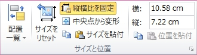
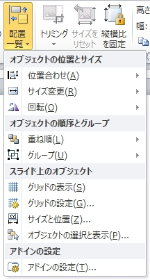

# PowerPointArrangeAddin

[](https://github.com/Aoi-hosizora/PowerPointArrangeAddin/releases)
[](./LICENSE)

+ A PowerPoint add-in (VSTO) for assisting arrangement operations, which is inspired by [iSlide Addin](https://www.islide.cc/).
+ Development environment: .NET Framework 4.8 (C# 7.3 / C# 9.0), Microsoft Office PowerPoint 2010
+ Supported languages: English, Simplified Chinese, Traditional Chinese, Japanese
+ Prerequisite: Microsoft Office >= 2010, x64

### Install

+ Step 1, download the compressed file that contains pre-built add-in files from [Release](https://github.com/Aoi-hosizora/PowerPointArrangeAddin/releases), and decompress it to a specific location.
+ Step 2, double click the decompressed `PowerPointArrangeAddin.vsto` file, and click "Install" to install the add-in.
+ If you want to uninstall the add-in, just open "Programs and Features" in "Control Panel", and uninstall "PowerPointArrangeAddin".

### Build manually

+ Build (Before building, you may need to generate your pfx file for signing)

```bash
cd ./PowerPointArrangeAddin/

# 1. Prepare Visual Studio environment
call vsdevcmd.bat

# 2. (Optional) Clean the built files of the add-in project
msbuild PowerPointArrangeAddin.csproj /p:Configuration=Release /p:Platform=x64 /t:Clean

# 3. Build the add-in project, and you can get the built files in "./bin/x64/Release/"
msbuild PowerPointArrangeAddin.csproj /p:Configuration=Release /p:Platform=x64

# Note: Once you build the project, the add-in will be registered automatically. 
# So you have to clean the project (/t:Clean) if you want to remove it from registry.
```

+ Publish manually (Use the built files, update some information, and re-sign the manifest file, which is how files in [Release](https://github.com/Aoi-hosizora/PowerPointArrangeAddin/releases) generated)

```bash
cd ./PowerPointArrangeAddin/

# 1. Replace the description in built vsto file, such as Publisher and SupportUrl
sed -i "s/asmv2:publisher=\"PowerPointArrangeAddin\"/asmv2:publisher=\"AoiHosizora\" asmv2:supportUrl=\"https:\/\/github.com\/Aoi-hosizora\/PowerPointArrangeAddin\"/" ./bin/x64/Release/PowerPointArrangeAddin.vsto

# 2. Re-sign the modified vsto file using the specific temporary key
mage -Sign ./bin/x64/Release/PowerPointArrangeAddin.vsto -CertFile PowerPointArrangeAddin_TemporaryKey.pfx -Password xxx

# 3. Just copy the bundle of built files to the solution folder, as a published folder "./Release/"
cp -r ./bin/x64/Release/ ../Release/

# 4. Clean the built files of the add-in project if you want to use the published vsto file to install
msbuild PowerPointArrangeAddin.csproj /p:Configuration=Release /p:Platform=x64 /t:Clean
```

+ Publish using ClickOnce (This method is not very recommended to me, because it generates lots of useless deployment files that have to be deleted manually after uninstalling)

```bash
cd ./PowerPointArrangeAddin/

# 1. Invoke msbuild using /t:Publish to generate publish files by ClickOnce
msbuild PowerPointArrangeAddin.csproj /p:Configuration=Release /p:Platform=x64 /p:BootstrapperEnabled=false /t:Publish

# 2.  Just copy bundle of built files to the solution folder, as a published folder "./Publish/"
cp -r ./bin/x64/Release/app.publish/ ../Publish/

# 3. Clean the built files of the add-in project if you want to use the published vsto file to install
msbuild PowerPointArrangeAddin.csproj /p:Configuration=Release /p:Platform=x64 /t:Clean
```

### Screenshots

|  |  |
|:--:|:--:|
| "Arrangement" group | "Textbox" group |
|  |  |
| "Replace picture" group | "Size and position" group |

|  |  |  |
|:--:|:--:|:--:|
| "Arrangement" menu | Add-in setting dialog | Add-in installation dialog |

### Tips

+ You are required to add the following PATH if you want to build the project by command line:
    + `C:\Windows\Microsoft.NET\Framework64\v4.x.xxxxx`
    + `...\Microsoft Visual Studio\xxxx\Enterprise\Common7\Tools`
    + `...\Microsoft SDKs\Windows\v10.0A\bin\NETFX 4.8 Tools`
+ If you have some problems on installation or building, try one of the following solutions:
    + **ATTENTION**: Before you perform operation, you must know that some operations are quite **DANGEROUS**, so please **MAKE SURE** that items you are about to modify are only related to "PowerPointArrangeAddin".
    1. Clean the solution and rebuild it, if it don't work, just restart your PC.
    2. Uninstall the add-in from "Control Panel" if "PowerPointArrangeAddin" exists.
    3. Remove following registry entries (keys or values) that are related to "PowerPointArrangeAddin".
        + `HKCU\SOFTWARE\Microsoft\Office\PowerPoint\Addins`
        + `HKCU\SOFTWARE\Microsoft\VSTA`
        + `HKCU\SOFTWARE\Microsoft\VSTO`
        + `HKCR\Software\Microsoft\Windows\CurrentVersion\Deployment\SideBySide\2.0\Components`
        + `HKCU\SOFTWARE\Microsoft\Windows\CurrentVersion\Uninstall`
    4. Remove subfolders and files in `C:\Users\<Username>\AppData\Local\Apps\2.0\*` that are related to "PowerPointArrangeAddin".
    5. Move the "Release" or "Publish" folders to a different location and try to install again. (Not Recommended)
    6. Regenerate a temporary key pfx file and try to build again build. (Not Recommended)

### References

+ [【顺其自然~】VSTO开发指南](https://blog.csdn.net/fuhanghang/article/details/101533271)
+ [VSTO之旅系列(三)：自定义Excel UI](https://blog.51cto.com/learninghard/1144298)
+ [Walkthrough: Create your first VSTO Add-in for PowerPoint](https://learn.microsoft.com/en-us/visualstudio/vsto/walkthrough-creating-your-first-vsto-add-in-for-powerpoint)
+ [How to: Customize a built-in tab (with list of control IDs)](https://github.com/MicrosoftDocs/visualstudio-docs/blob/main/docs/vsto/how-to-customize-a-built-in-tab.md)
+ [C# VSTO Add-in Excel: What is the name of this Excel Super-Tab Control and how to make it?](https://stackoverflow.com/questions/61189402/c-sharp-vsto-add-in-excel-what-is-the-name-of-this-excel-super-tab-control-and)
+ [【VBA A2Z】Playlist: VBA to .NET / VSTO](https://www.youtube.com/playlist?list=PLo0aMPtFIFDqaRyd0KZ0DLXFD3rfhI4SU)
+ [C# 8/9の言語機能を.NET Frameworkで使う](https://qiita.com/kenichiuda/items/fada6068ea265fd6a389)
+ [Custom UI XML Markup Specification (with Customui Schema)](https://learn.microsoft.com/en-us/openspecs/office_standards/ms-customui/31f152d6-2a5d-4b50-a867-9dbc6d01aa43)
+ [Customizing a Ribbon Through Size Definitions and Scaling Policies](https://learn.microsoft.com/en-us/windows/win32/windowsribbon/windowsribbon-templates)
+ [Registry entries for VSTO Add-ins](https://learn.microsoft.com/en-us/visualstudio/vsto/registry-entries-for-vsto-add-ins)
+ [Customizing the 2007 Office Fluent Ribbon for Developers](https://learn.microsoft.com/en-us/previous-versions/office/developer/office-2007/aa338202(v=office.12))
+ [Replace a picture on a slide in PowerPoint using VSTO](https://stackoverflow.com/questions/76696349/replace-a-picture-on-a-slide-in-powerpoint-using-vsto)
+ [Exception from HRESULT 0x800A01A8 in PowerPoint solutions](https://www.add-in-express.com/creating-addins-blog/exception-hresult-0x800a01a8/)
+ [<customization> element (Application manifests for Office solutions)](https://learn.microsoft.com/en-us/visualstudio/vsto/customization-element-office-development-in-visual-studio?view=vs-2019)
+ [给VSTO 解决方案指定产品名、发布者以及其他属性信息](https://www.cnblogs.com/monster1799/p/1310866.html)
+ [ClickOnceでの再インストールでエラー発生](https://blog.regrex.jp/2016/09/02/post-972/)
+ [Deploying a VSTO Solution Using Windows Installer](https://learn.microsoft.com/en-us/visualstudio/vsto/deploying-a-vsto-solution-by-using-windows-installer?view=vs-2022)
+ [【Visual Studio2017/2019/2022】コマンドラインからビルドすると「8000000A」エラーが発生する](https://juraku-software.net/visual-studio2017-command-build-8000000a-error/)
+ [WiX Toolset v3 Tutorial](https://www.firegiant.com/docs/wix/v3/tutorial/)
+ [WiX でセットアッププロジェクト](https://qiita.com/hiro_t/items/2b51ec2d495eb31a07b0)
+ [【stoneniqiu】随笔分类 - Wix](https://www.cnblogs.com/stoneniqiu/category/522235.html)
+ [Windows Installer手引書 Part.13 カスタムアクションを実行させるタイミング](https://qiita.com/tohshima/items/8d1d7e702d58dc1429d2)
+ [Windows Installer手引書 Part.14 インストール、アンインストールの区別](https://qiita.com/tohshima/items/72d1e7602a48055c55f5)
+ ["Create Shortcut" Checkbox](https://stackoverflow.com/questions/4658220/create-shortcut-checkbox)
+ [(Wix) MSI uninstall is very slow. Log shows slowness is when shortcuts are being removed](https://stackoverflow.com/questions/63581670/wix-msi-uninstall-is-very-slow-log-shows-slowness-is-when-shortcuts-are-being)
+ [External annotations (JetBrains ReSharper)](https://www.jetbrains.com/help/resharper/Code_Analysis__External_Annotations.html)
+ [Visual Studio App Center, Distribute, Release a Build](https://learn.microsoft.com/en-us/appcenter/distribution/uploading)
+ [App Center API Documentation](https://learn.microsoft.com/en-us/appcenter/api-docs/#app-center-openapi-specification-swagger)
+ [C# で TaskDialog を使う](http://grabacr.net/archives/105)
+ [C#: comctl32.dll version 6 in debugger](https://stackoverflow.com/questions/1415270/c-comctl32-dll-version-6-in-debugger)
